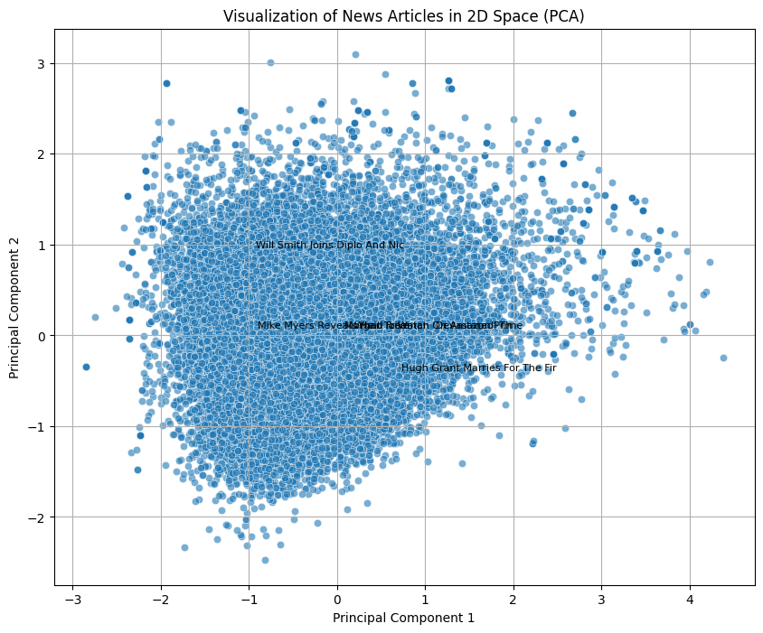
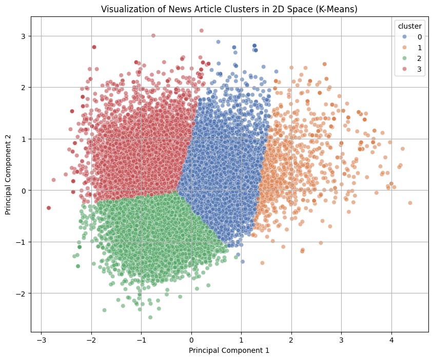
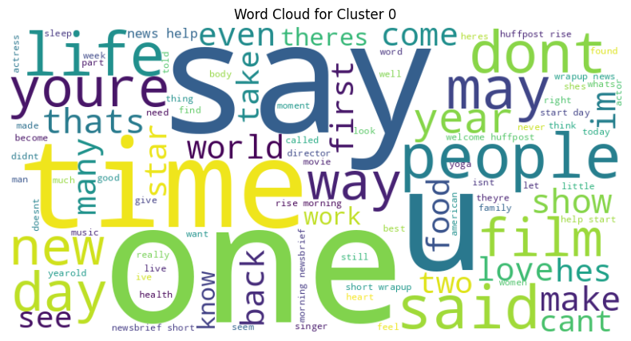
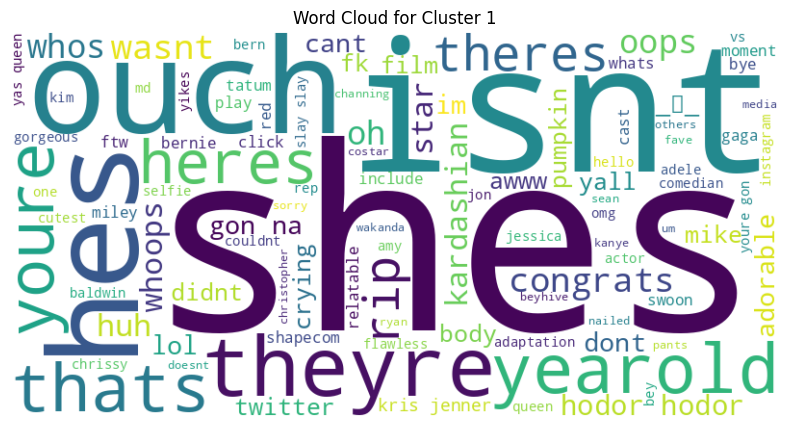
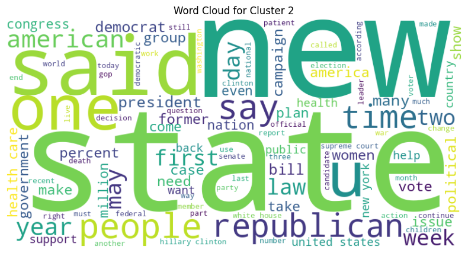
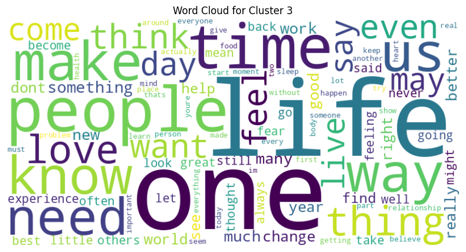

# News Article Similarity Analysis

This project clusters news articles based on their semantic similarity using NLP techniques. It was completed as a learning exercise to demonstrate skills in text processing, embedding, clustering, and visualization.

## Overview
- **Dataset**: Public news articles dataset from [mage-ai](https://raw.githubusercontent.com/mage-ai/datasets/refs/heads/master/news_articles.csv).
- **Techniques**: GloVe embeddings, PCA, K-Means clustering, Word Clouds.
- **Goal**: Group similar articles and visualize key themes.

## Visualizations
### PCA Scatter Plot


### Clustered Scatter Plot


### Word Clouds





## Installation
```bash
pip install pandas numpy matplotlib seaborn nltk scikit-learn wordcloud

Usage
Open the notebook news_article_similarity_analysis.ipynb in Jupyter or Google Colab to run the analysis. Visualizations are saved in the plots/ directory.

Notes
GloVe embeddings are downloaded from Hugging Face during execution.
This project was inspired by a learning exercise and implemented independently to master NLP and clustering techniques.